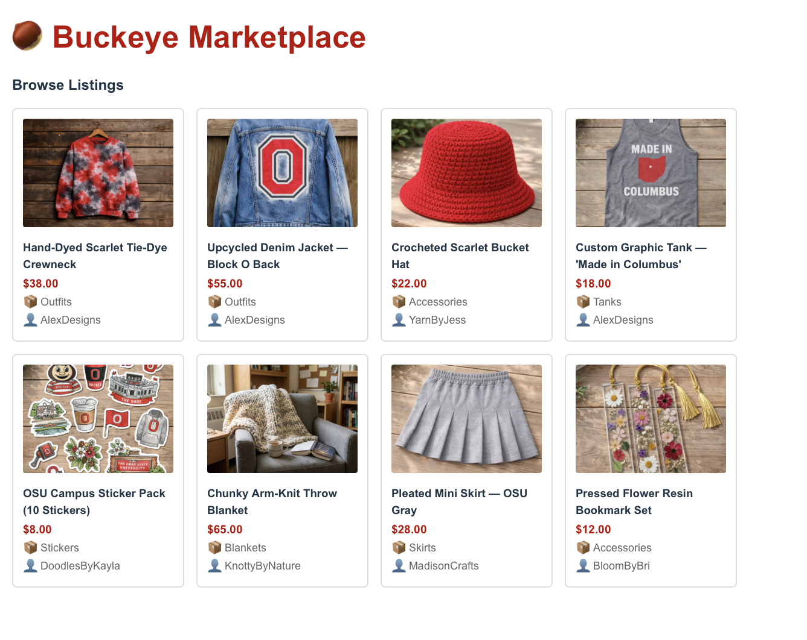
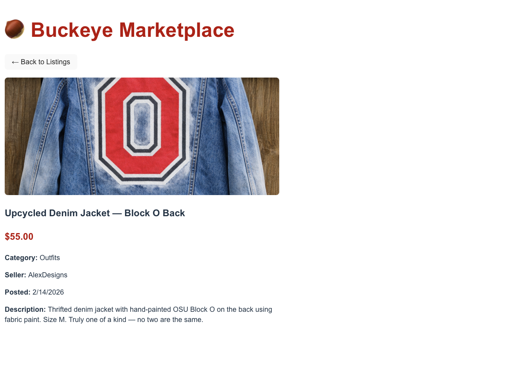

# 🌰 Buckeye Marketplace

A student-to-student marketplace for OSU students to buy and sell handmade and upcycled goods including outfits, accessories,  stickers, blankets, and skirts.

## Table of Contents
- [Overview](#overview)
- [How to Run Locally](#how-to-run-locally)
- [Screenshots](#screenshots)
- [AI Usage Summary](#ai-usage-summary)

## Overview

Buckeye Marketplace connects OSU students through a creative marketplace where student makers like Alex (Graphic Design junior) can sell their handmade and upcycled designs directly to buyers like Emily who want unique, affordable OSU-themed items and Barbara who is searching for gifts for her grandson.

## How to Run Locally

**Backend (.NET API)**
```bash
cd BuckeyeMarketplace.API
dotnet run
```
API runs at http://localhost:5136

**Frontend (React)**
```bash
cd frontend
npm install
npm run dev
```
App runs at http://localhost:5173

## Screenshots

**Product List Page**


**Product Detail Page**


## AI Usage Summary

**Tool used:** Claude (Anthropic)

**What I asked AI to help with:**
- Scaffolding the ProductsController structure
- Generating sample product data themed around OSU student handmade goods
- Help in building React components for ProductCard, ProductList, and ProductListPage
- Debugging CORS configuration and terminal issues

**Prompts used:**
1. "Help me create a .NET ProductsController with in-memory sample data for a handmade student marketplace"
2. "Walk me through building React components for a product list and detail page that fetch from a .NET API"
3. "Help me debug why my React app won't connect to my .NET API"

**What I accepted vs. modified:**
- Accepted: overall component structure, product data categories and themes
- Modified: product descriptions and images to match my M1 persona research, specifically Emily (budget buyer) , Barbara (gift0buyer)and Alex (creative seller of upcycled designs)
- My own judgment: folder structure, port numbers, image selection, final styling decisions
