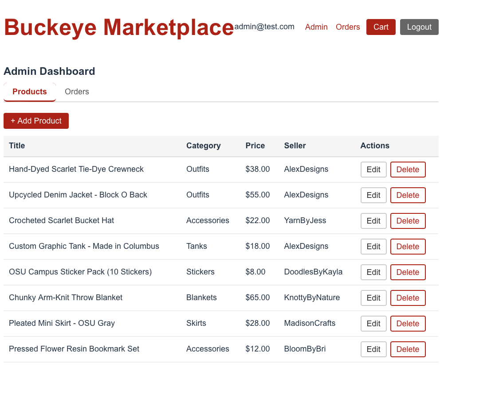
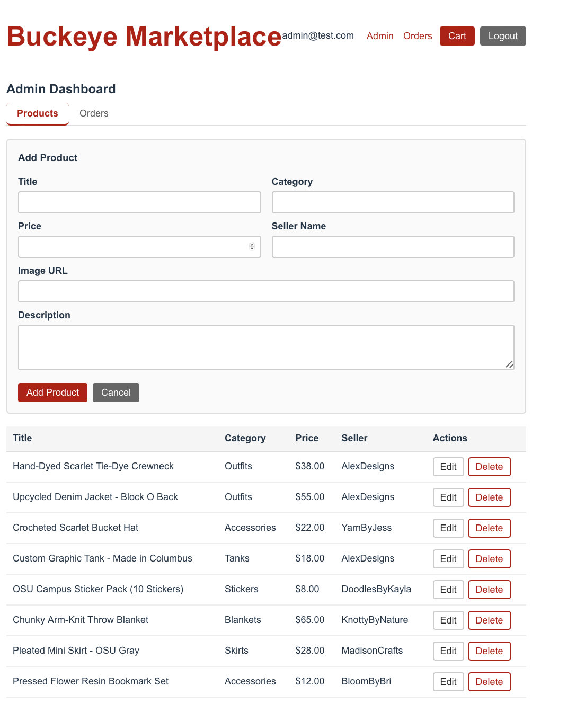
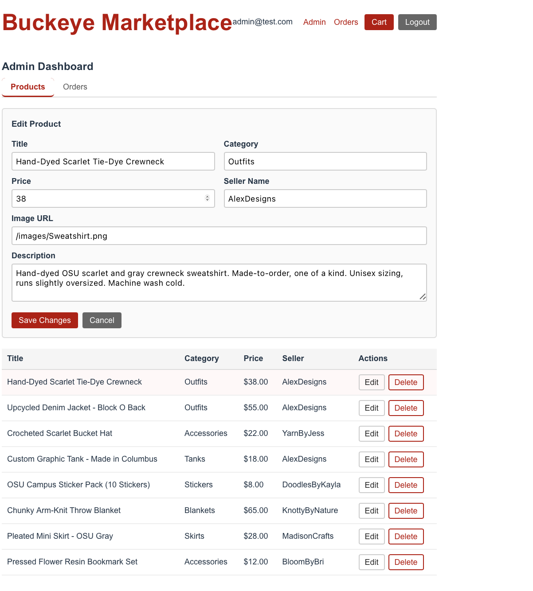
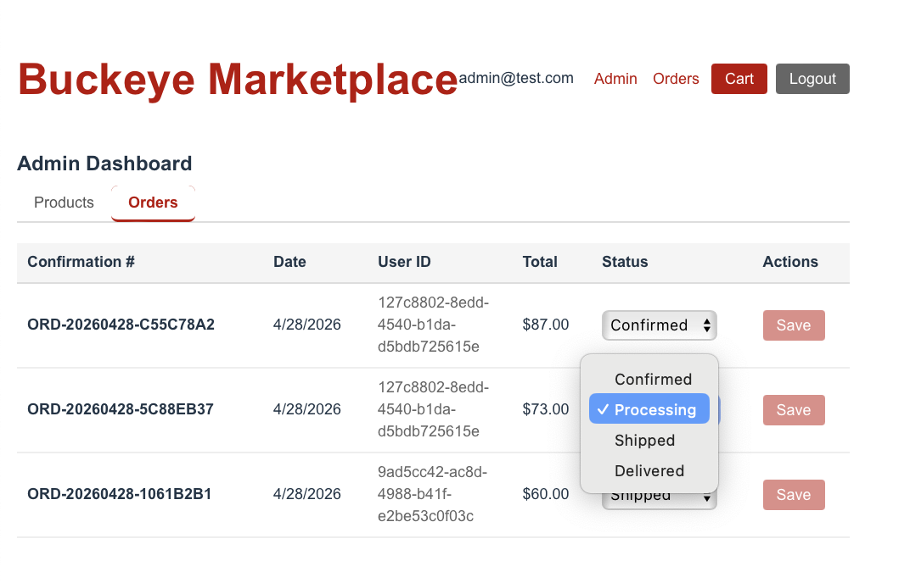

# Buckeye Marketplace — Admin Guide

**Live Application:** https://yellow-smoke-03bf58010.7.azurestaticapps.net

This guide is for administrators only. Admin access is restricted to accounts
with the Admin role. The seeded admin credentials are:

- **Email:** admin@test.com
- **Password:** Admin123!

---

## Table of Contents

1. [Accessing the Admin Dashboard](#1-accessing-the-admin-dashboard)
2. [Managing Products](#2-managing-products)
   - [Adding a Product](#adding-a-product)
   - [Editing a Product](#editing-a-product)
   - [Deleting a Product](#deleting-a-product)
3. [Managing Orders](#3-managing-orders)
   - [Viewing All Orders](#viewing-all-orders)
   - [Updating Order Status](#updating-order-status)

---

## 1. Accessing the Admin Dashboard

1. Navigate to the live application and click **Login** in the navigation bar.
2. Enter the admin credentials and click **Login**.
3. Once logged in, an **Admin** link appears in the navigation bar (only visible
   to admin accounts). Click **Admin**.

The Admin Dashboard has two tabs:
- **Products** — manage all product listings
- **Orders** — view and update all customer orders

---

## 2. Managing Products

The **Products** tab is the default view. It shows a table of all current
listings with columns for Title, Category, Price, Seller, and Actions.

---

### Adding a Product

1. From the Products tab, click the red **+ Add Product** button above the
   product table.

   

2. Fill in all fields:

   | Field | Description |
   |---|---|
   | **Title** | The product name shown to buyers |
   | **Category** | Product category (e.g. Outfits, Accessories, Stickers) |
   | **Price** | Numeric price in dollars (e.g. `22.00`) |
   | **Seller Name** | The seller's display name |
   | **Image URL** | A full URL or relative path to the product image |
   | **Description** | Full product description shown on the detail page |

3. Click **Add Product** to save. The new listing will appear immediately in
   the product table and on the public browse page.

   Click **Cancel** to discard without saving.

---

### Editing a Product

1. In the product table, find the listing you want to update and click its
   **Edit** button.

   

2. The Add Product form transforms into an Edit Product form with all current
   values pre-filled. Update any fields as needed.

3. Click **Save Changes** to apply the update. The product table and public
   listing page will reflect the changes immediately.

   Click **Cancel** to discard changes and return to the product table.

---

### Deleting a Product

1. In the product table, find the listing you want to remove and click its
   red **Delete** button.
2. The product is removed immediately from the table and from the public browse
   page.

> **Note:** Deletion is permanent. Deleted products cannot be recovered through
> the UI. Any existing orders that referenced the deleted product retain their
> order item records.

---

## 3. Managing Orders

Click the **Orders** tab in the Admin Dashboard to view all orders placed by
all customers.

---

### Viewing All Orders

The orders table shows:

| Column | Description |
|---|---|
| **Confirmation #** | Unique order ID (e.g. `ORD-20260428-C55C78A2`) |
| **Date** | Date the order was placed |
| **User ID** | Internal ID of the customer who placed the order |
| **Total** | Order total in dollars |
| **Status** | Current fulfillment status — editable via dropdown |
| **Actions** | Save button to apply status changes |

Orders are listed in the order they were placed.

---

### Updating Order Status

1. In the Orders table, find the order you want to update.
2. Click the **Status** dropdown on that row.
3. Select the new status:

   | Status | Meaning |
   |---|---|
   | **Confirmed** | Order received and confirmed |
   | **Processing** | Order is being prepared |
   | **Shipped** | Order has been dispatched |
   | **Delivered** | Order has been received by the customer |

4. Click the **Save** button on the same row to apply the change.

The updated status is immediately visible to the customer on their
Order History page.
