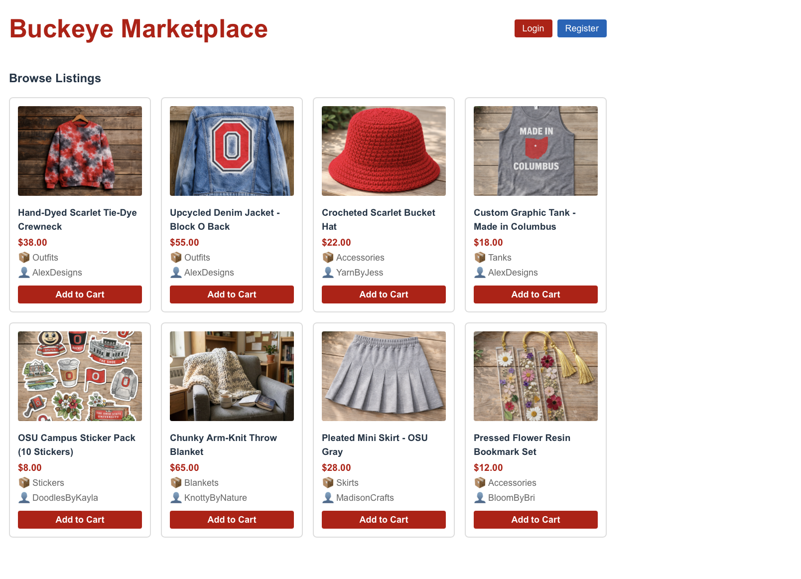
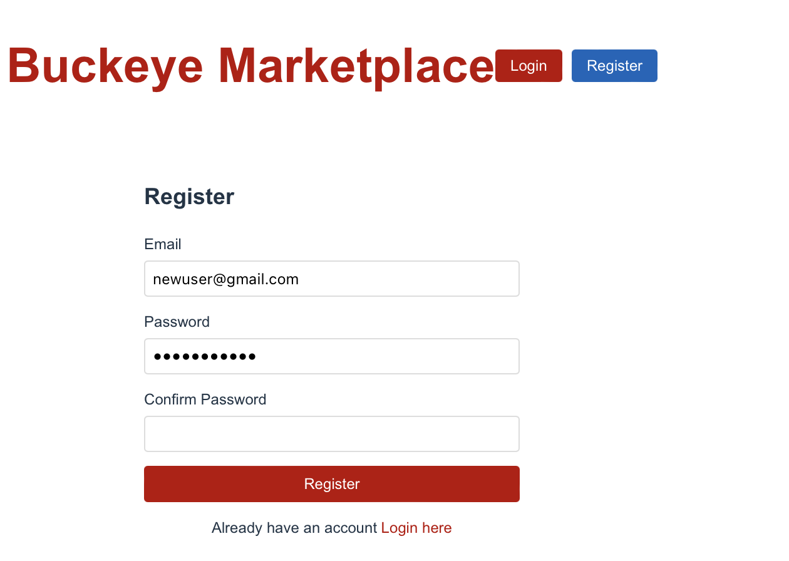
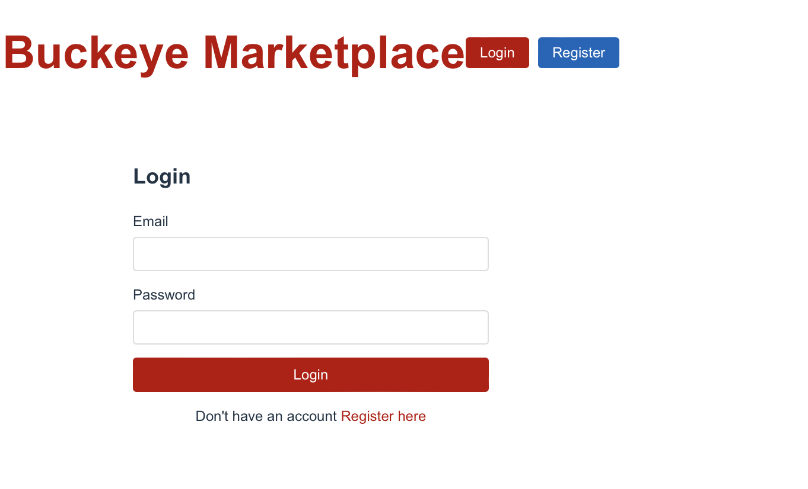
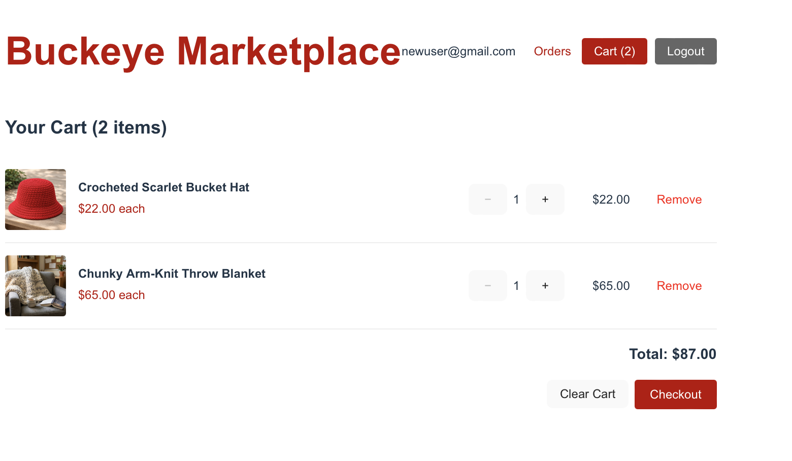
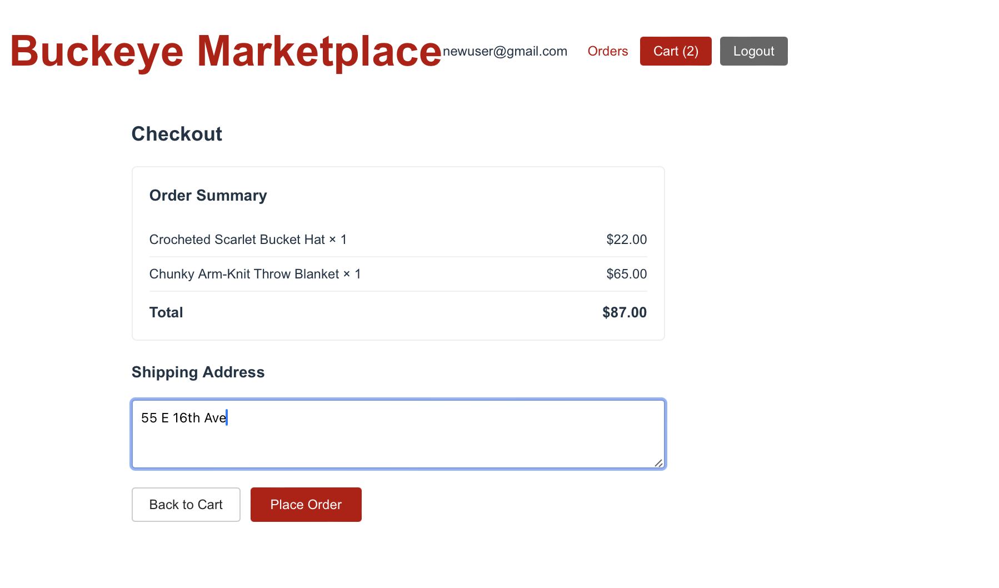
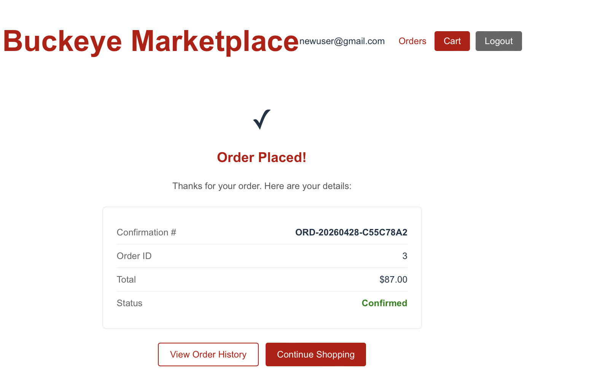
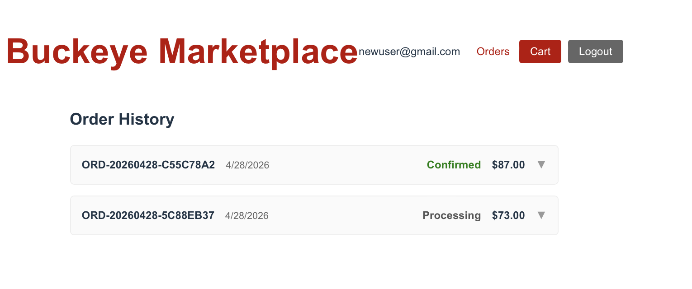

# Buckeye Marketplace — User Guide

**Live Application:** https://yellow-smoke-03bf58010.7.azurestaticapps.net

Buckeye Marketplace is a student-to-student marketplace where OSU students can
browse and purchase handmade and upcycled goods — outfits, accessories,
stickers, blankets, and more. No account is needed to browse; an account is
required to add items to your cart and place an order.

---

## Table of Contents

1. [Browsing Products](#1-browsing-products)
2. [Creating an Account](#2-creating-an-account)
3. [Logging In](#3-logging-in)
4. [Adding Items to Your Cart](#4-adding-items-to-your-cart)
5. [Placing an Order](#5-placing-an-order)
6. [Viewing Your Order History](#6-viewing-your-order-history)

---

## 1. Browsing Products

When you open the app, you land directly on the **Browse Listings** page.

Each product card shows:
- Product image
- Title and price (in OSU scarlet)
- Category and seller name
- An **Add to Cart** button

> **Note:** Clicking **Add to Cart** from the listing page while not logged in
> will prompt you to log in first.

**To view a product's full description and detail page:**

Click the product title or image. The detail page shows the complete
description, price, seller, and post date alongside the Add to Cart button.

---

## 2. Creating an Account

1. Click **Register** in the top-right navigation bar.

   

2. Enter your **email address** and choose a **password**.

   Password requirements:
   - Minimum 8 characters
   - At least one uppercase letter (e.g. A–Z)
   - At least one digit (e.g. 0–9)

3. Re-enter your password in the **Confirm Password** field.
4. Click the red **Register** button.

You will be logged in automatically and redirected to the home page. The
navigation bar will update to show your email, an **Orders** link, a **Cart**
button, and a **Logout** button.

> If the email is already registered, you will see an error. Click
> **Login here** at the bottom of the form instead.

---

## 3. Logging In

1. Click **Login** in the top-right navigation bar.

   

2. Enter your registered **email** and **password**.
3. Click the red **Login** button.

You will be redirected to the home page with your session active. Your email
address appears in the navigation bar confirming you are logged in.

> Don't have an account yet? Click **Register here** at the bottom of the
> login form.

---

## 4. Adding Items to Your Cart

You must be logged in to add items to your cart.

1. From the Browse Listings page (or a product detail page), click
   **Add to Cart** on any item.
2. The **Cart** button in the navigation bar will update to show the number
   of items in your cart (e.g. **Cart (2)**).

**To view and manage your cart:**

Click the **Cart** button in the navigation bar.

The cart page shows:
- Each item's image, name, and unit price
- Quantity controls (**−** and **+**) to adjust the amount of each item
- A **Remove** link to delete an item from your cart
- The running **Total** in the bottom-right
- A **Clear Cart** button to remove all items at once
- A **Checkout** button to proceed to purchase

---

## 5. Placing an Order

From the Cart page, click the red **Checkout** button.

The Checkout page shows:
- An **Order Summary** listing each item and its price, with the total
- A **Shipping Address** field — enter your full street address, city, state,
  and ZIP code

Click **Place Order** to submit. If you need to make changes, click
**Back to Cart**.

**After placing your order:**

The confirmation screen shows:
- A confirmation checkmark
- Your **Confirmation #** (e.g. `ORD-20260428-C55C78A2`) — save this for
  your records
- Order ID, total, and status (**Confirmed**)

Click **View Order History** to see all your past orders, or
**Continue Shopping** to return to the browse page.

---

## 6. Viewing Your Order History

Click **Orders** in the navigation bar (only visible when logged in).

The Order History page lists all your past orders, showing:
- **Confirmation number** (e.g. `ORD-20260428-C55C78A2`)
- **Order date**
- **Status** — Confirmed (green), Processing (gray), Shipped, or Delivered
- **Order total**

Click the arrow (▼) on any order to expand it and see the individual items.

---

## Tips & Troubleshooting

| Issue | Solution |
|---|---|
| "Add to Cart" doesn't work | Make sure you are logged in — click **Login** in the nav |
| Can't see Orders link | The Orders link only appears when you are logged in |
| Forgot password | Contact admin@test.com — self-service password reset is not yet available |
| Order placed but cart still shows items | Refresh the page — the cart clears automatically after a successful order |
